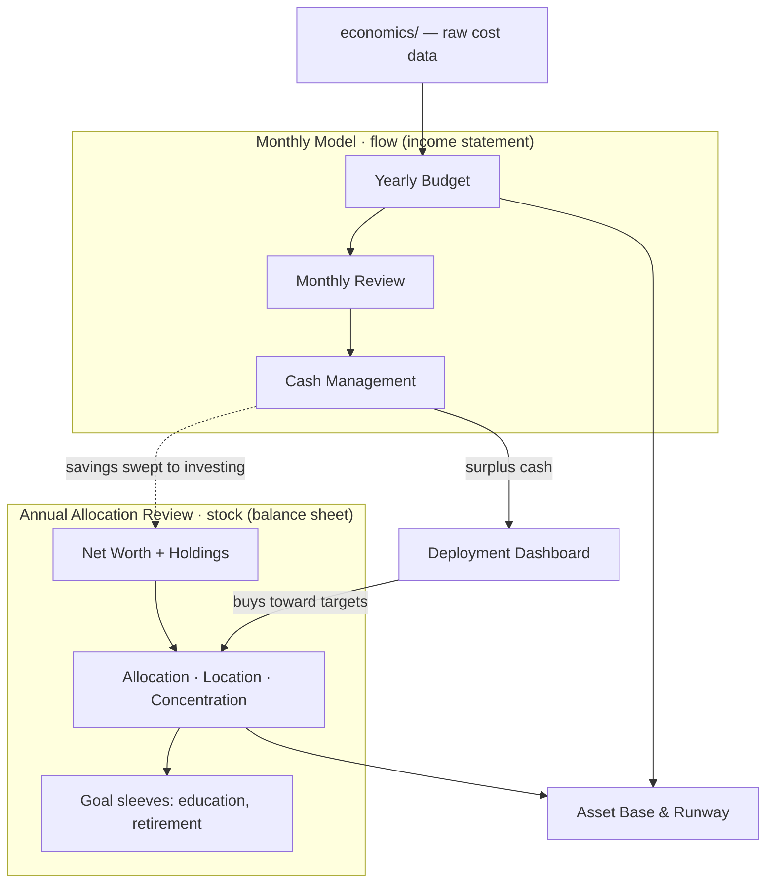

# g finance — README

> [!abstract] What this folder is
> A connected set of systems for running our household finances — knowing **what we spend**, **what we own**, and **how to put cash to work** — each updated on the cadence that fits it. This note is the map; the [[#Folder map|folders]] below hold the detail.

---

## The three systems at a glance

| System | Question it answers | Lens | Cadence |
|---|---|---|---|
| **[[Financial Model — System Design\|Monthly Financial Model]]** | "Where did the money go, and is cash positioned right?" | Income statement (**flow**) | Monthly |
| **[[Annual Allocation Review — System Design\|Annual Allocation Review]]** | "What do we own, and is it mixed/located right?" | Balance sheet (**stock**) | Yearly |
| **[[Deployment Dashboard — System Design\|Deployment Dashboard]]** | "How do we put surplus cash to work without timing the market by gut?" | The bridge (**flow → stock**) | Weekly / event-driven, until done |

---

## How they relate

The core idea: the **Monthly Model is flow, the Annual Review is stock, and savings is the bridge** — what the monthly system sweeps out each month becomes the inflow that reshapes the annual balance sheet. The **Deployment Dashboard** is the mechanism that actually moves surplus cash into the target allocation. And **[[Asset Base & Runway]]** sits across both — it divides what we own (from the Annual Review) by what we burn (from the Monthly Model) to answer "how long could we last with no income?"

---

## Goal of each system

### 🗓️ Monthly Financial Model — *the income statement*
Know where money goes each month, hit category targets, and keep cash in the right place at the right time. Three layers: a **yearly budget** ([[Yearly Budget 2026]], [[Category Taxonomy]]), a **monthly review** of actuals vs target ([[Monthly Review Template]], [[Merchant Rules]]), and **cash management** ([[Cash Dashboard]]). Inputs: card transactions (email) + bank statements (PDF). → [[Financial Model — System Design]]

### 📅 Annual Allocation Review — *the balance sheet*
Once a year, roll up net worth and check the **whole portfolio**: asset-class mix vs target, tax-location, concentration, and goal-funded sleeves ([[Education Funding Plan]]). Produces an action checklist (rebalance, contributions, Roth conversions). Targets live in [[Target Allocation 2026]]; accounts in [[Account Inventory]]. → [[Annual Allocation Review — System Design]]

### 💵 Deployment Dashboard — *the bridge*
Deploy ~$1M of surplus cash **by rule**: a time-floor backstop plus volatility/drawdown accelerators decide *when*, and the allocation gap decides *where*. Removes gut-timing while still capturing dips. Operational steps go in [[Deployment Runbook]]. → [[Deployment Dashboard — System Design]]

### 🧭 Cross-cutting: Asset Base & Runway
"How long could we fund our life with no income?" Liquid assets ÷ burn. Draws from both systems. → [[Asset Base & Runway]]

---

## Folder map

- **system design/** — the three blueprints (the architecture layer; they cross-reference each other)
- **budget & spend/** — taxonomy, merchant rules, monthly review, yearly budget
- **cash & runway/** — cash dashboard, asset base & runway
- **investments/** — account inventory, target allocation, education funding
- **deployment/** — deployment runbook
- **economics/** — raw cost source notes (grocery, home, health, subscriptions, annual spend) that *feed* the budget

---

## Status & build order

> [!note] Most notes are placeholders for now
> 1. **Lock [[Category Taxonomy]] first** — both the budget and the monthly review depend on it.
> 2. Then [[Yearly Budget 2026]] → [[Monthly Review Template]] + [[Merchant Rules]].
> 3. **[[Target Allocation 2026]] is being settled in a separate thread** — the Annual Review and Deployment systems wait on it.
> 4. [[Deployment Runbook]] is blocked on the allocation + deployment parameters.

---
*Drafted with Claude · 2026-06-14*
